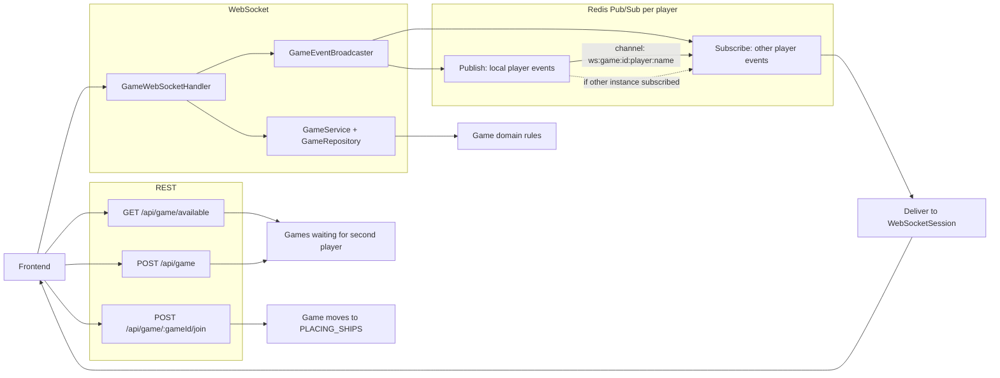

# Battleship API

Backend do projeto Battleship, implementado com Spring Boot.

## Navegacao

- README principal: [../../README.md](../../README.md)
- README do frontend: [../../battleship_app/README.md](../../battleship_app/README.md)

## Stack

- Java 17
- Spring Boot 3.2.2
- Spring Web
- Spring WebSocket
- Spring Data JPA
- PostgreSQL
- Maven
- JUnit 5 (spring-boot-starter-test)

## O que a API cobre hoje

- Criar jogo
- Entrar em jogo existente
- Consultar estado por jogador
- Receber e processar mensagens de partida via WebSocket
- Regras de dominio (turno, ataque, destruicao e vitoria)
- Armazenamento em memoria para partidas ativas no profile `dev` (em `prod`/`test`, persistencia via JPA)

## Camada de persistencia

- A persistencia foi organizada em modelo de portas e adaptadores para desacoplar dominio e infraestrutura.
- Portas de saida:
  - `repository/GameRepository` (acesso principal ao agregado de jogo no fluxo da aplicacao)
  - `service/persistence/port/GameStatePersistencePort` (snapshot de estado para salvar/recuperar)
- Adaptadores/implementacoes:
  - `repository/impl/InMemoryGameRepository` (`@Profile("dev")`) para desenvolvimento sem banco
  - `repository/impl/jpa/JpaGameRepository` (`@Profile({ "prod", "test" })`) para persistir o agregado com JPA
  - `persistence/adapter/JpaGameStatePersistenceAdapter` (`@Profile({ "prod", "test" })`) para implementar a porta de snapshot
- Mapeamento e modelo de persistencia:
  - DTOs de snapshot em `dto/persistence`
  - Entidades JPA em `persistence/entity` (`GameEntity`, `PlayerEntity`, `BoardEntity`, `AttackEntity`)
  - Mapper central em `persistence/mapper/GameEntityMapper`
- Profiles e banco:
  - `dev`: sem datasource/JPA (autoconfiguracoes JDBC/JPA desativadas em `application-dev.properties`)
  - `prod`: PostgreSQL (`application-prod.properties`)
  - `test`: H2 em memoria com `ddl-auto=create-drop` (`application-test.properties`)

## Como executar

Windows:

```bash
cd battleship_api/battleship
.\mvnw.cmd "spring-boot:run" "-Dspring-boot.run.profiles=dev"
.\mvnw.cmd "spring-boot:run" "-Dspring-boot.run.profiles=prod"
```

Linux/macOS:

```bash
cd battleship_api/battleship
./mvnw spring-boot:run -Dspring-boot.run.profiles=dev
./mvnw spring-boot:run -Dspring-boot.run.profiles=prod
```

Observacao: o profile `dev` sobe a API sem banco de dados; o profile `prod` espera PostgreSQL disponivel com as variaveis `DB_URL`, `DB_USERNAME` e `DB_PASSWORD` opcionalmente definidas. O profile `test` usa H2 em memoria.

Servidor: http://localhost:8080

## REST API

Base path: /api/game

### Listar jogos disponiveis

- Metodo: GET /api/game/available

### Criar jogo

- Metodo: POST /api/game
- Body:

```json
{
  "playerName": "Player1"
}
```

### Entrar no jogo

- Metodo: POST /api/game/{gameId}/join
- Body:

```json
{
  "playerName": "Player2"
}
```

### Consultar estado

- Metodo: GET /api/game/{gameId}?playerName=Player1

Exemplo de resposta (resumo):

```json
{
  "gameId": "4a4572e4-b488-4c10-814e-cce4afc2f1fd",
  "gameStatus": "IN_PROGRESS",
  "player1Name": "Player1",
  "player2Name": "Player2",
  "currentPlayer": "Player1",
  "myTurn": true,
  "winner": null,
  "turnNumber": 7,
  "myShipsRemaining": 3,
  "opponentShipsRemaining": 2,
  "myAttacksCount": 15,
  "myShips": [
    { "name": "porta_avioes", "size": 5, "hits": 1, "destroyed": false, "placed": true }
  ],
  "myBoardCells": [
    { "x": 0, "y": 0, "attacked": false, "hit": false, "hasShip": true }
  ],
  "opponentBoardCells": [
    { "x": 4, "y": 7, "attacked": true, "hit": false, "hasShip": false }
  ]
}
```

Observacoes:

- `myBoardCells` e `opponentBoardCells` retornam o estado detalhado de 100 celulas de cada tabuleiro.
- `myShips` expõe o estado dos navios do jogador para renderizacao do HUD.
- Essa rota e utilizada para bootstrap/reconexao e fallback de sincronizacao do cliente.

## WebSocket

- Endpoint: ws://localhost:8080/ws/game?gameId=<id>&playerName=<nome>

### Mensagens inbound

Campos comuns:

```json
{
  "type": "ATTACK|PLACE_SHIP|PLAYER_READY",
  "gameId": "<id>",
  "playerName": "Player1"
}
```

ATTACK:

```json
{
  "type": "ATTACK",
  "gameId": "<id>",
  "playerName": "Player1",
  "x": 4,
  "y": 7
}
```

PLACE_SHIP:

```json
{
  "type": "PLACE_SHIP",
  "gameId": "<id>",
  "playerName": "Player1",
  "shipType": "bombardeiro",
  "size": 4,
  "x": 0,
  "y": 0,
  "orientation": "HORIZONTAL"
}
```

PLAYER_READY:

```json
{
  "type": "PLAYER_READY",
  "gameId": "<id>",
  "playerName": "Player1"
}
```

### Eventos outbound

- ATTACK_RESULT
- GAME_STATE_UPDATED
- PLAYER_READY
- GAME_START
- SHIP_PLACED
- ERROR

## Fluxo da partida



Fluxo resumido:

1. O frontend cria a partida via REST com `POST /api/game`.
2. Enquanto nao houver segundo jogador, a partida continua em `WAITING_FOR_PLAYERS` e aparece em `GET /api/game/available`.
3. Quando outro jogador entra em `POST /api/game/{gameId}/join`, a partida sai de espera e passa para a fase de posicionamento.
4. As acoes em tempo real usam WebSocket em `/ws/game`.
5. O backend publica os eventos no Redis em canal por jogador (ex.: `ws:game:{gameId}:player:{playerName}`). Cada instância que tem uma sessão daquele jogador se inscreve naquele canal.
6. Quando um evento ocorre (ATTACK, PLAYER_READY, etc.), o handler publica para os canais de TODOS os jogadores da partida, e cada instância entrega apenas para suas sessões locais correspondentes.
7. Isso permite que jogadores conectados em instâncias diferentes recebam o mesmo evento sem depender de memória local compartilhada (ex.: A em Instância 1, B em Instância 2; ambos recebem qualquer evento da partida).

### Exemplo: Estrutura na AWS com 2 Tasks

```text
┌───────────────────────────────────────────────┐
│         AWS ECS (Elastic Container)           │
│                                               │
│  ┌───────────────────┐  ┌───────────────────┐ │
│  │   Task/Inst 1     │  │   Task/Inst 2     │ │
│  │  (Port 8080)      │  │  (Port 8080)      │ │
│  │                   │  │                   │ │
│  │ GameSessions:     │  │ GameSessions:     │ │
│  │ ├─ "Jogador 1"    │  ├─ "Jogador 2"      │ │
│  │ └─ (Ws conectado) │  │ └─ (Ws conectado) │ │
│  └───────────────────┘  └───────────────────┘ │
│         ▲                      ▲              │
│         │                      │              │                      
└─────────┼──────────────────────┼──────────────┘
          │                      │
          └──────────┬───────────┘
                     │
              ┌──────▼────────┐
              │  AWS ALB      │
              │ (Load         │
              │  Balancer)    │
              └──────▲────────┘
                     │
                     │ URL pública: https://aws.....com
                     │
            ┌────────┴──────────┐
            │                   │
         Player A           Player B
       (browser)           (browser)
```

Como funciona nesse cenário:

1. Cada Task e uma instancia independente da API Spring Boot.
2. O ALB distribui as conexoes WebSocket entre as Tasks.
3. Cada instancia mantem apenas suas sessoes locais (players conectados nela).
4. Quando ocorre um evento, a API publica no Redis em um canal por player (`ws:game:{gameId}:player:{playerName}`).
5. Todas as instancias podem receber mensagens do Redis, mas cada uma entrega apenas para a sessao local correspondente ao player do canal.
6. Resultado: players conectados em Tasks diferentes continuam sincronizados em tempo real.

## Integracao com frontend

- CORS HTTP liberado para http://localhost:3000
- WebSocket registrado em /ws/game
- Frontend esperado em [../../battleship_app/README.md](../../battleship_app/README.md)

## Testes

Windows:

```bash
cd battleship_api/battleship
mvnw.cmd clean test
```

Linux/macOS:

```bash
cd battleship_api/battleship
./mvnw clean test
```

